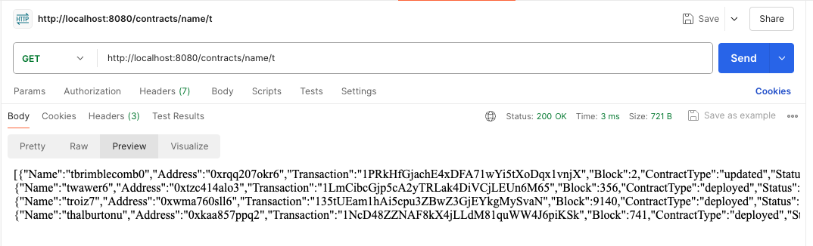
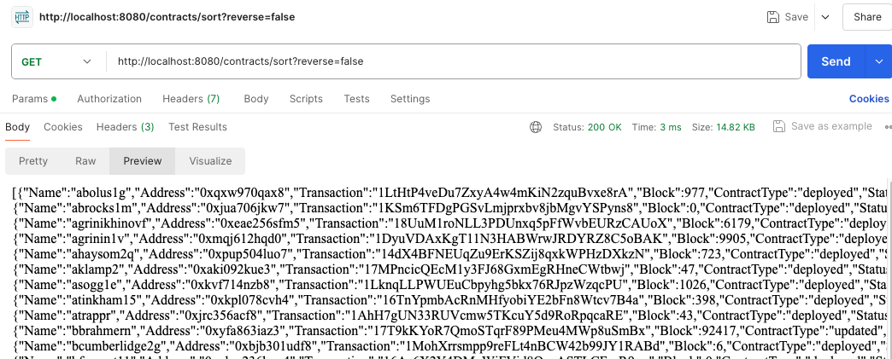

## Motivation

This is my first attempt at using Go. I used FindLab's [feature request](https://roadmap.findlabs.io/p/search-and-filter-contracts) in its roadmap as a mini project idea. In short, on FlowDiver.io, clients can view multiple 
Web3 contracts as they wish. However, currently there is no easy way to sort the contracts alphabetically by name or find the contracts by name. So in short, this project aims doing just those two things:
1. Sorting contracts by name alpha-numerically in both regular and reverse order.
2. Finding contracts by its exact name or by matching its prefix. 

Some improvements I can remember for my next Go project.
- I need to write unit/integration tests as I develop and think about how my code can make testing easier.
- I could try using **gin** as a web framework instead of **mux** next time. It seems pretty widely used.
- My REST API could be built to support sorting for address, transactions...etc other fields dynamically.
- Every REST API query should not have to query the DB every time. There could be some cache...

## Project Design

Like most CRUD apps, this project has 3 basic layers to it. 
1. REST API end-points exposed to clients
2. The server which handles some business logic (eg. sorting and finding by name)\
3. A database

### REST API 
To expose the REST API, I used a library called **gorilla/mux**. It was pretty easy to set up different 
routes. Basically I exposed 3 separate GET API calls.

```
GET /contracts  -> returns all the contracts
GET /contracts/name/{name}  -> returns any contracts where the names or prefix match {name}
GET /contracts/sort?reverse={'true'|'false'}  -> returns the contracts sorted by name, optionally reversed order
```

Here's an example of finding all contracts whose name starts with **t**.


Here's an example of sorting contracts by alpha-numerical order.


### Server side sort and find
For the server, to handle business logic like sorting. I used libraries like **slices** and **sort**. 
As I came from a Java/Python background mostly, I found having to call these libraries a bit tedious. 
In Java/Python, often times there are built in functions like **.reverse()** or **sorted()** which 
makes development overhead a bit easier.

### Postgres Database
To keep things simple for the DB, I simply fired up a local instance of a postgres DB. I used some 
online generator to generate 100 rows of data in the the **Contracts** table. This is the scehma I used
| Row | Type | Example |
| ----------- | ----------- | ----------- |
| id | INT |  1
| name | VARCHAR(50) | 'tbrimblecomb0'
| address | VARCHAR(50) | '0xrqq207okr6'
| transaction_id | VARCHAR(50) |  '1PRkHfGjachE4xDFA71wYi5tXoDqx1vnjX'
| block | Title | '2'
| contractType | VARCHAR(8) | 'updated'
| status | VARCHAR(5) |  'ok'

The two libraries I used for connecting to postgres were **"database/sql"** **"github.com/lib/pq"**. I think 
both of these were pretty standard. I had to call `go get` to download some of these dependencies. I did
run into some dependency issues at times when I was trying to download. It took some configuring, and at
one point I realized my Go-lang version was very old at 1.12, so I then upgraded to the latest and that
solved quite a few issues.

## Final Thoughts 
As my first attempt at using Go, this was a somewhat good introduction. I had previously read a few articles
on Go-lang so I did have a very basic idea, but building this project still humbled me. Actually having to engineer
some features made me learn the language much faster.But I do think it will be helpful to go back to the basics
and just power through some of the tutorials to get a much better overview of the language before diving into my next project.

Overall, it felt like Go lacked some of the good-to-have features that Java/Python provides. However, I also do
agree that Go development feels very fast. There isn't a lot of verbose code like Java and at the same time
I get to control a lot of the error checking myself which isn't supported as well in Python.
